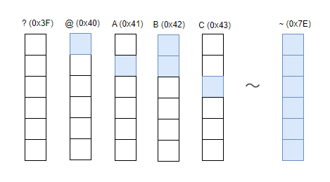
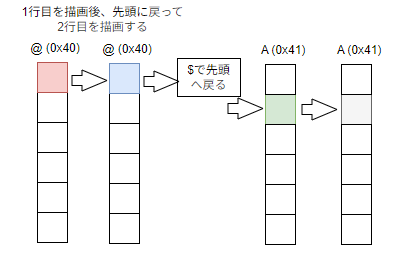

# Sixel画像コンバーター

## はじめに

画像をSixel Graphics形式に変換することで、ターミナルに描画するプログラムです

Windows Terminal(1.22)等、Sixelグラフィックスをサポートするターミナルで実行できます


### Sixel Graphicsとは

Sixel Graphicsは、特別なエスケープシーケンスをターミナルに送信することで、画像を表示する技術です。特定の文字を送信することで、文字に対応した縦に6ピクセルの画像を出力することができます。出力位置を右、下にずらしながら画面全体を描画することができます。

### プログラムの概要

`sixelConverter.ts`スクリプトは、画像ファイルを読み込み、そのピクセルデータを処理してSixel Graphics文字列に変換します。この文字列はSixel Graphicsをサポートするターミナルに出力でき、ターミナル内で直接画像を表示することができます。

node環境には`canvas`がないため、`node-canvas`モジュールのインストールが必要です


### 画像を表示するエスケープシーケンスの構造について

* 全体の構成は下記のようになっています

  `Sixel開始シーケンス,アスペクト比,解像度の指定,カラーパレットの定義,Sixelデータ文字,終了シーケンス`

   * 開始シーケンス、アスペクト比、解像度の指定 は固定なので後述のサンプルを参照

## カラーパレット

カラーパレットは色番号(0～255)とそれに対応した色を定義します。ピクセルの描画を行う際は色番号を指定して出力を行います。以下にカラーパレットの定義例を示します。

`#0(色番号);2(RGB指定);(red;green;blue)#1(色番号);2(RGB指定);(red;green;blue)#2・・・`

`#0;2;102;0;0#1;2;0;0;102`

## Sixelデータ文字について

Sixelデータ文字 は、 ? (0x3F) から ~ (0x7E) の範囲の文字です。
直前で指定された色で、縦に6ピクセル分の出力を行います。

| ? (0x3F) | @ (0x40) | A (0x41) | B (0x42) | C (0x43)  |～| ~ (0x7E) |
| ---- | ---- | ---- | ---- | ---- |---- | ---- |
| 000000 | 000001 | 000010 | 000011 | 000100 |～| 111111 |


* `@`は上下6ピクセルのうち一番上のピクセルを、`~`は6ピクセル全てを塗りつぶします

* 塗りつぶしをしないピクセルは`透明`扱いです。既に塗りつぶされたピクセルの色を上書きしません





6ピクセル別々の色を出力するためには、描画が重ならない文字 `@` ⇒ `A` ⇒ `C` ⇒ `G` ⇒ `O` ⇒ `_` を順に描画します

### 2×2の画像を描画するサンプル

以下に、2×2の画像を描画する手順を示します。各ステップを順に追って説明します。

一番上を塗りつぶす`@`と、2ピクセル目を塗りつぶす`A`を使い、色の指定と左右の位置を行いながら描画していきます


赤(左上@)⇒青(右上@)⇒先頭に戻る($)⇒緑(左下A)⇒白(右下A)の順に1pixelずつ描画



  `\x1BPq"1;1;96;96#1;2;102;0;0#2;2;0;0;102#3;2;0;102;0#4;2;102;102;102#1@#2@$#3A#4A$\x1B\`

| 文字シーケンス| 概要 | 補足 |
| ---- | ---- |  ---- |
| `\x1BPq` | Sixel開始シーケンス | ESC(\x1B) + 'Pq'  |
| `"1;1;96;96`| アスペクト比1:1、解像度96dpi x 96dpi |  |
| #1;2;102;0;0 | カラーパレットの定義(#1,赤) |  #1(色番号);2(RGB指定);(red;green;blue) |
| #2;2;0;0;102 | カラーパレットの定義(#2,緑) | 〃 |
| #3;2;0;102;0 | カラーパレットの定義(#3,青) | 〃 |
| #4;2;102;102;102 | カラーパレットの定義(#4,灰) |  |
| #1@ | #1で@を描画(して右に1ピクセルずれる) | @は縦に6pixelのうち先頭1pxのみ |
| #2@ | #2で@を描画(して右に1ピクセルずれる) | 〃 |
| $ | 描画位置を行頭に戻す | `$-`は次の行(6pixel下)の先頭へ移動 |
| #3A | #3でAを描画(して右に1ピクセルずれる) | Aは縦に6pixelのうち2px目のみ |
| #4A |  #3でAを描画(して右に1ピクセルずれる) | 〃 |
| \x1B\ | Sixel終了シーケンス |  ESC(\x1B) + '/' |


## 説明

このNode.jsスクリプトは、入力として画像ファイルを受け取り、Sixelグラフィックスを使用してターミナルに表示します。

その仕組みは以下の通りです。

1.  指定された画像ファイルを読み込みます。
2.  `node-canvas` を使用して、画像のピクセルデータにアクセスします。
3.  各ピクセルの色を216色のWebセーフカラーパレットに減色します。
4.  減色されたピクセルデータをSixelグラフィックス文字列に変換します。


この`sixelConverter.ts`スクリプトは、入力として画像ファイルを受け取り、Sixelグラフィックスを使用してターミナルに表示します。

仕組みは以下の通りです

1. **imageLoader**: 画像ファイルを読み込み、Canvasを使用してそのピクセルデータを取得します。
1. **reductionColor**: 画像の色を216色のWebセーフパレットに減色します。
1. **convertToSixel**: 減色されたデータをSixel Graphics文字列に変換します。
1. **main**: 画像の読み込み、色の減少、Sixel変換プロセスを調整するメイン関数です。


## 使用方法

スクリプトを実行する前に、ターミナルがSixel Graphicsをサポートしていることを確認してください。


```bash
npx tsx sixelConverter.ts <画像ファイルパス>
```

**デバッグオプション:**

オプションで、2番目の引数として `-d` を渡すと、カラーデータ、カラーマップ、およびエスケープシーケンスがエスケープされたSixel文字列を含むデバッグ情報を出力します

```bash
npx tsx sixelConverter.ts my_picture.png -d
```

## 依存関係

以下に各依存関係の簡単な説明を追加します。

このスクリプトは、以下のNode.jsモジュールに依存しています。

* **node-canvas**: 画像の読み込みとピクセルデータへの変換に利用します
* **tsx**: TypeScriptファイルをそのまま実行するために使用します


## インストール

Node.jsとnpmのバージョンを確認して、互換性を確保してください。

Node.jsとnpmがインストール済みであることを前提として、以下を実行します。

```bash
npm install canvas
```

または

```bash
yarn add canvas
```

## 注意事項

以下に既知の問題や制限、または潜在的な回避策を含めます。

* **Windowsターミナル:** Windowsターミナルでは、Node.jsの実行時に拡張子 `.exe` を明示的に指定する必要がある場合があります。
  ```bash
  node.exe sixelConverter.js <画像ファイル>
  ```
* **Sixelサポート:** 出力を正しく表示するには、ターミナルエミュレータがSixelグラフィックスをサポートしている必要があります。
* **パフォーマンス:** 最適化が不十分なため、処理に時間がかかる場合があります。
    ```bash
    node.exe sixelConverter.js <画像ファイル>
    ```
* **Sixelサポート:** 出力を正しく表示するには、ターミナルエミュレータがSixelグラフィックスをサポートしている必要があります
* **パフォーマンス:** 最適化が不十分なため、処理に時間がかかる場合があります
